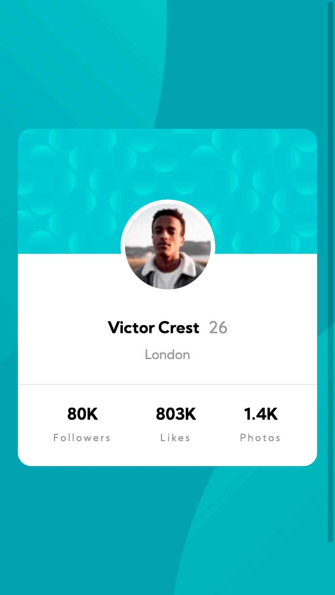
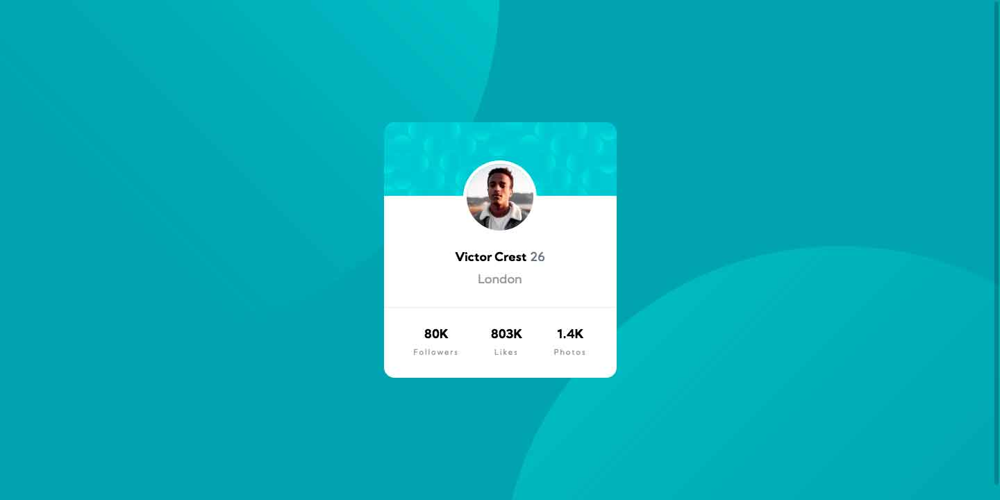

# Frontend Mentor - Profile card component solution

This is a solution to the [Profile card component challenge on Frontend Mentor](https://www.frontendmentor.io/challenges/profile-card-component-cfArpWshJ). Frontend Mentor challenges help you improve your coding skills by building realistic projects. 

## Table of contents

- [Overview](#overview)
  - [The challenge](#the-challenge)
  - [Screenshot](#screenshot)
  - [Links](#links)
- [My process](#my-process)
  - [Built with](#built-with)
  - [What I learned](#what-i-learned)
  - [Continued development](#continued-development)
  - [Useful resources](#useful-resources)
- [Author](#author)

## Overview

This is a nice simple design of a profile card. I'm going to use BEM naming for the project and pure HTML and CSS. I think it is perfect to practice the basis before going up on complexity.

### The challenge

- Build out the project to the designs provided

### Screenshot





### Links

- Solution URL: [https://github.com/NoaDevRefresh/webComponents/tree/main/profileCard]
- Live Site URL: [https://noadevrefresh.github.io/webComponents/profileCard/]

## My process

1. First I took decisions on tools and stacks I was using for the challenge
2. Next I programmed the layout with HTML, trying to keep semantics and encapsulation.
3. I added the styles following mobile first.
4. I refactor and optimize if possible.
5. I tested the design on Firefox and Chrome.

### Built with

- Semantic HTML5 markup
- CSS
- Flexbox
- Mobile-first workflow

### What I learned

I relearned about flexbox and viewport units. Even though I had worked with them before I had to research and relearn to get the background exactly on the right spot. Besides I wanted it to be perfectly adaptative, so I used viewport units and got it to work fine and without media queries.

I'm specially proud of this:

```css
background-image: url("./images/bg-pattern-top.svg"), url("./images/bg-pattern-bottom.svg");
    background-repeat: no-repeat, no-repeat;
    background-position-y: top -70vh, bottom -85vh;
    background-position-x: right 50vw, left 50vw;
}
```
### Continued development

I'm actually learning about preprocessors and I'm looking forward working with them and being able to apply what I'm learning on my next challenge. I think this will make a difference in optimization on my code.

I decided to work on this challenge first because it seemed to be easy enough to try Frontend Mentor out and see how the process works. I have to say that I liked working on it and I'm looking forward to work on more challenging designs on the future.

### Useful resources

- [https://css-tricks.com/snippets/css/a-guide-to-flexbox/](https://www.css-tricks.com) - Like every time I need flexbox this site saved me dearly.
- [https://css-tricks.com/fun-viewport-units/](https://www.css-tricks.com) - And also came on hand for the use of viewport units
## Author

- Website - [https://github.com/NoaDevRefresh](myGithubSite )
- Frontend Mentor - [@NoaDevRefresh](https://www.frontendmentor.io/profile/NoaDevRefresh)
- Twitter - [@dev_noa](https://www.twitter.com/dev_noa)

